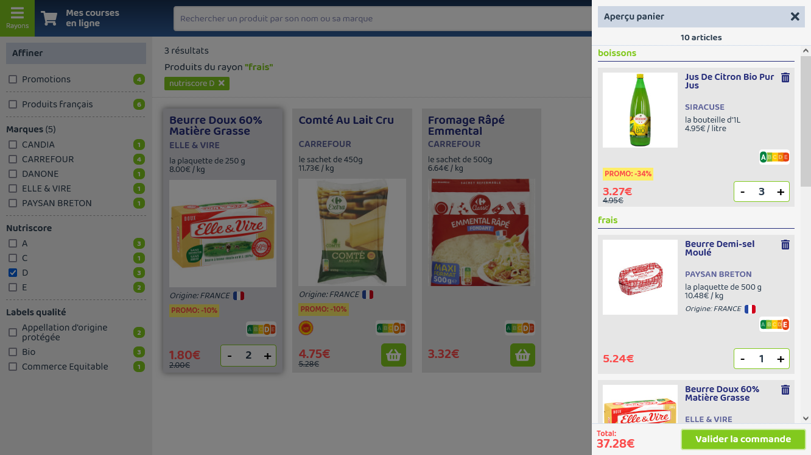

# Site de courses en ligne

## Documentation utilisateur

Le but de cette application était de tenter de reproduire un site classique de course en ligne. Après avoir regardé ce qui existe, je me suis inspiré de certains d'entre eux pour ce qui est des fonctionnalités (moteur de recherche, classification des articles par rayons, présentation des produits,...).  

**[Cliquez ici](https://appshopping-st.herokuapp.com/) pour voir l'application en ligne.**

_Page d'accueil_


### Trouver un article
Il existe plusieurs moyens de trouver des articles pour constituer son panier :

- En recherchant par rayon (icone en haut à droite de l'écran): Une marge à gauche de l'écran apparait présentant une liste de rayons (cf. img ci-dessous).  
Lorsque l'on clique sur l'un d'entre eux, les produits correspondants apparaissent.


- En utilisant la recherche principale, dans le bandeau en haut de l'écran.  
Un autocomplete apparait pour proposer des articles en fonction de la saisie de l'utilisateur (cf.img ci-dessous). La liste de l'autocomplete est mise à jour à chaque frappe dans le champ de recherche.  
L'utilisateur peut cliquer sur un des articles proposés, ou bien valider sa saisie dans le champ de recherche.

_Liste de proposition d'articles lors de la recherche_


### Les filtres
De nombreux produits peuvent correspondre à la recherche.  
Des filtres sont donc présents dans la marge pour trouver plus rapidement l'article recherché (cf. img ci-dessous).  

_Marge filtres et liste des produits_


Vous pouvez filtrer :
- Les articles en promotion,
- Les articles made in France,
- Par marque, 
- Par nutriscore, 
- Par label qualité  

Ces filtres sont cumulables bien entendu.  
A noter que vous pouvez filtrer sur les marques avec un champ de saisie pour trouver facilement celle(s) qui vous intéresse

### Panier

Vous ajoutez vos articles en saisissant la quantité désirée (icone panier en bas à droite d'un encart article).  
L'état de votre panier est consultable à tout moment en cliquant sur l'icone en haut à droite de l'écran. Le montant du panier est affiché en dessous de l'icône.  

_Liste de produits filtrés et panier_


Vos articles sélectionnés sont alors visibles dans la marge qui s'ouvre à droite de l'écran (cf. img ci-dessous).  

_Marge panier_



Vous pouvez y changer les quantités commandées, supprimer un article (en mettant la quantité à zéro, ou en cliquant sur l'icone poubelle en haut à droite du produit), ou enfin valider votre commande, ce qui videra votre panier et vous redirigera vers la page d'accueil.

### Promotions

Le calcul du prix du panier tient compte des promotions sur les articles (s'il y en a).  
Ces promos sont de 2 types:
- Un pourcentage sur le prix,
- Une réduction pour X articles commandés.


### Améliorations possibles

Par manque de temps, je n'ai pas pu développer tout ce que je voulais mettre en place. Il serait par exemple souhaitable de:
- Rendre l'application responsive, pour que l'affichage s'adapte aux petits écrans
- Mettre en place un système d'authentification avec login/mot de passe. Cela permettrait à l'utilisateur:
  - d'enregistrer (dans mongoDB) ses courses et ainsi d'avoir son historique en page d'accueil,
  - de mettre en place une fonctionnalité de création de panier(s) type(s) en cochant les produits qui serai(en)t dans ce(s) panier(s) 

## Documentation technique

### Technologies utilisées
Vue.js + Node.js + mongoDB


### Démarches pour MongoDB Atlas

#### Inscription et connexion

Les données des rayons et des articles sont stockées avec mongoDB Atlas qui est la version Cloud de ce système de gestion de bases de données NoSQL.  
Mais avant de pouvoir l'utiliser, il va falloir faire quelques installations.  
Je vous invite à regarder l'excellent tutoriel de The Net Ninja (tuto #9 Node.js Crash Course Tutorial) pour vous aider dans cette tache ([lien tuto]()) : 

1. Aller sur le site [https://www.mongodb.com/fr-fr/cloud/atlas](https://www.mongodb.com/fr-fr/cloud/atlas),
2. Se créer un compte
3. Créer :
  - Un cluster, 
  - Une database avec comme nom '_db_shopping_', 
  - Des collections aux noms de '_departments_' et '_products_',
  - Un user (laisser les options 'read and write to any database' lors de cette étape),
4. Alimenter les collections créées à l'étape précédente avec Mongo shell, ou bien si vous travaillez avec l'éditeur Visual Studio Code (comme beaucoup de gens :-)), téléchargez l'extension '_MongoDB for VS Code_' (une icone apparaitra alors sur le bord gauche de l'éditeur pour accéder au marketplace), puis connectez-vous à votre cluster et executez le fichier '_Generation_db_shopping_collections.mongodb_' dans le projet.  
L'exécution de ce fichier va alimenter les collections '_departments_' et '_products_'  
5. Dans le menu '_Cluster_', lorsque l'on clique sur le bouton '_connect_', une fenêtre apparait. En choisissant l'option '_Connect your application_', vous verrez alors la chaine de connexion qui va permettre de dialoguer avec la base de données.  
Cette chaine est déjà présente dans le projet (fichier '_/API/index.js_') mais si vous avez créé votre propre base de données et que vous voulez la connecter à l'application, il faudra la remplacer par la votre, en prenant soin de ne pas mettre les login, mot de passe et nom de la base de donnée en dur.  
Ces paramètres sont dans des variables : Nous les avons externalisés dans un fichier '_identifiants_mongoDB.js_' (modèle ci-dessous) qu'il vous faudra créer, et que vous placerez dans '_/API/config_'.

_Structure du fichier 'identifiants_mongoDB.js': Remplacez la valeur des propriétés par celles que vous avez saisies lors de la création de votre bdd_
```
module.exports = {
    "username": "XXXXX",
    "password": "XXXXX",
    "db": "XXXXX"
}
```


#### Moteur de recherche
Un champ de recherche sur les produits et marques se trouve dans le header de l'application.
Il fonctionne grace à des indexs que l'on doit créer avec Mongodb Atlas Search ([Voir le tuto ici](https://developer.mongodb.com/how-to/build-movie-search-application/)).  
Grace à son index, le champ de recherche comprend:
- <ins>Une autocompletion</ins>. Dès les premiers caractères saisis, des produits sont proposés pour aider l'utilisateur et lui éviter de devoir saisir le terme exact dans le moteur de recherche pour qu'il s'affiche,
- Des résultats proposés avec <ins>une tolérence de variation de caractère</ins> (dont le nombre est à paramétrer, ici 1).  
 Cela permet de trouver ce que l'on recherche malgré une erreur de frappe ou d'orthographe,
- <ins>Le surlignage</ins> (highlight) des termes au plus proche de ce que l'utilisateur a recherchés.


Concrètement, un index permet de mettre en place des fonctionnalités avancées de recherche.  
Pour créer ces indexs dans l'interface mongoDB Atlas, placez-vous dans votre cluster et cliquez sur le menu horizontal '_Search_'.

_interface mongoDB Atlas: page de création des indexs_


En cliquant sur le bouton 'Create Index', copiez/collez le code ci-dessous en prenant soin de le nommer '_products_autocomplete_'.   

_Index 'products_autocomplete' pour l'API alimentant l'autocompletion :_

```
{
  "mappings": { 
    "dynamic": false,
    "fields": {
      "intitule": [
        {
          "type": "string"
        },
        {
          "foldDiacritics": false,
          "maxGrams": 10,
          "minGrams": 4,
          "type": "autocomplete"
        }
      ],
      "marque": [
        {
          "type": "string"
        },
        {
          "foldDiacritics": false,
          "maxGrams": 10,
          "minGrams": 4,
          "type": "autocomplete"
        }
      ]
    }
  }
}
```

Faites de même pour l'index '_products_'. Il sera utilisé dans les requêtes appelées suite à la validation sur le moteur de recherche de produits/marque:
- Pour rechercher des produits 
- Pour récupérer les filtres sur ces produits

Cet index doit être créé sur la collection '_products_'

```
{
  "mappings": {
    "dynamic": true
  }
}
```

NOTE : Attention ! Les index seront supprimés lorsque vous alimentez la liste des articles via le fichier '_Generation_db_shopping_collections.mongodb_'

## Mise en production du projet
Les étapes de mise en prod. diffèrent selon l'hébergeur.  
Ici, j'ai choisi d'héberger l'application sur Héroku. Il existe de multiples façons de mettre en production sur cet hébergeur.  
J'ai choisi la methode avec Git : Il s'agit d'associer son répertoire Git local dans lequel se trouve son projet, avec un répertoire Git distant sur le serveur Heroku. L'idée est de pousser le code de notre Git local vers le Git Heroku.  
Voici comment j'ai procédé:

1. Si cela n'est pas déjà fait, **installez Heroku CLI**. C'est ce qui va nous permettre d'interpréter les commandes passées via le terminal pour mettre en ligne le projet.  Pour vérifier qu'il est bien installé, taper '_heroku -v_' pour connaitre la version (si ce n'est pas le cas vous aurez un message d'erreur)  
2. **Se créer un compte** sur le site de Heroku,  
3. **Se loguer** via la commande dans le terminal '_heroku login_',  
4. **Créer son repository Git distant** : Commande '_Heroku create <ins>nom-de-l'app</ins>_'.  
Le nom de l'app est facultatif. S'il n'est pas spécifié, Heroku va s'en charger et lui attribuer un nom au hasard. Sachant que ce nom va se retrouver dans l'URL pour accéder au projet une fois hébergé (_https://<ins>nom-de-l'app</ins>.herokuapp.com/_), il est préférable de le faire.

Heroku ne peut héberger que la partie back-end de notre app, celle faite avec Node.js. On va donc préparer notre projet car ce qui va être mis en prod. ne sera que le contenu du répertoire 'API', et non le répertoire 'App' qui correspond au code Front.

5. **Ajouter du code du coté back-end du projet**: 
  - Dans le fichier de démarrage/d'initialisation 'index.js', on ajoute du code interprété seulement en mode production. Il déclare en assets les fichiers du repertoire Front buildé (répertoire 'public') que l'on va générer plus bas, et affiche le fichier '/public/index.html' pour toute requete.  
  ```
  if(process.env.NODE_ENV === 'production') {
    // La partie Front faite avec Vue.js est buildée dans le rep. 'public' qui est déclaré comme static
    app.use(express.static(__dirname + '/public/'));
    // Pour ttes requetes 'get', affichage de la page 'index.html' du code Front buildé dans rep. 'public'
    app.get(/.*/, (req, res) => res.sendFile(__dirname + '/public/index.html'))
}
  ```
  - Dans le fichier 'package.json', section 'scripts', on ajoute '_"start": "node index"_'.  

    On commit et on push ces modifs.


6. **Créer son repository Git local** : Maintenant on va créer un repository Git de notre projet que l'on va préparer dans le but de pousser le code vers Heroku.    

  - Je fais donc une copie de mon projet dans un nouveau repertoire (en faisant un git clone de mon repository Git distant, ou bien en copiant/collant mon projet présent sur ma machine).
  - Je supprime le répertoire '.git' dans cette copie s'il y en a un (pas sûr que cela soit obligatoire)
  - Je builde le code Front (dans le terminal taper '_npm run build_'). Par défaut un répertoire 'dist' devrait être généré à la racine de la partie Front du projet (repertoire 'App'), mais on reparamètre cela dans notre fichier 'vue.config.js' (option 'outputDir'): Le répertoire contenant le js front buildé se nommera alors 'public' et sera placé dans la partie back (répertoire 'API').
  - Je descends dans le répertoire 'API': C'est son contenu que je vais envoyer sur le serveur.
  - Une fois dedans, à la racine, je créé un fichier 'Procfile' (sans extension), qui va executer la commande pour lancer l'application sur le serveur de prod.  
  Contenu du fichier _Procfile_
  ```
  web: npm start
  ```
  - J'initialise un nouveau Git repository sur le projet (cmd '_git init_').  
  - J'ajoute mon code dans le repository ('_git add ._' puis '_git commit -m "mon commentaire"_').  

7. **Pousser le code vers le serveur Heroku**: Taper la commande '_git push heroku master_'.  
Cela signifie que l'on pousse le code de la branche master de notre repository Git local, vers le Git distant nommé par défaut 'heroku'.

Et voilà!!


  ## Project setup
```
npm install
```

### Compiles and hot-reloads for development
```
npm run serve
```

### Compiles and minifies for production
```
npm run build
```

### Lints and fixes files
```
npm run lint
```

### Customize configuration
See [Configuration Reference](https://cli.vuejs.org/config/).

